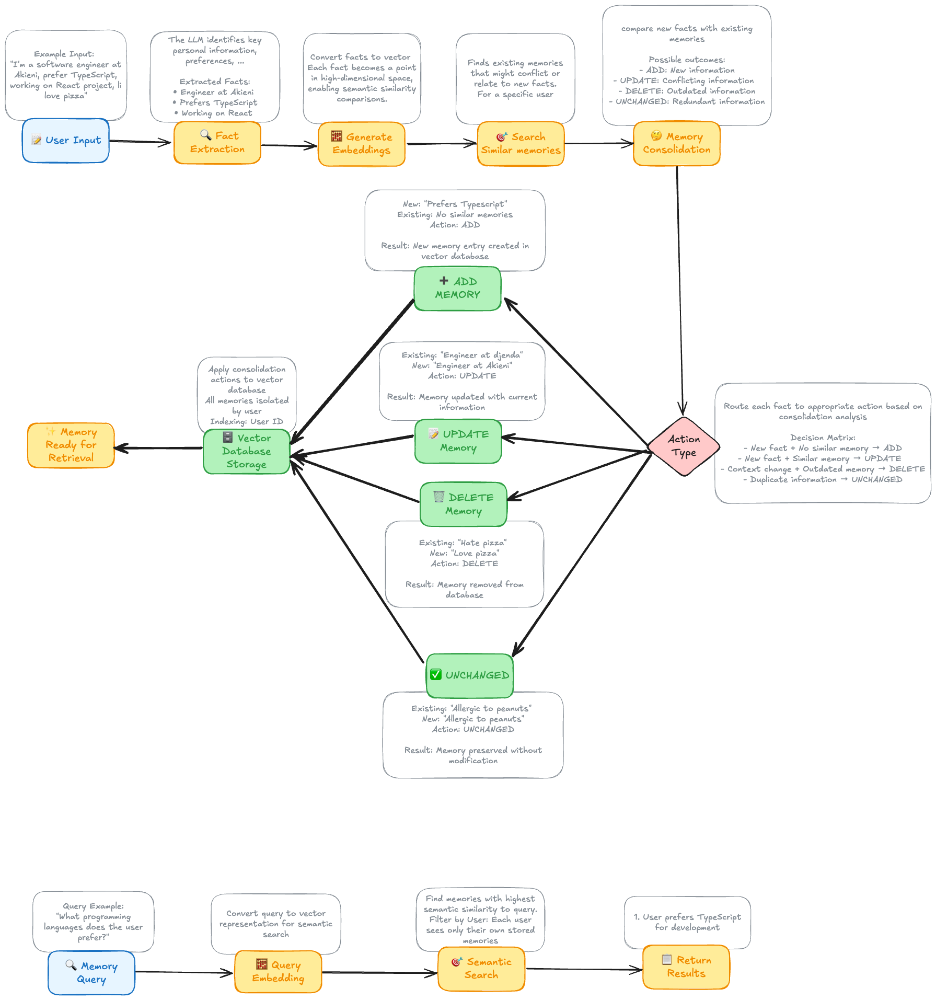

# Agentic  Memory System




> **Inspired by Mem0: Building Production-Ready AI Agents with Scalable Long-Term Memory and Mem0 repo**

This educational repository demonstrates an agentic memory system implementation based on the research from [Mem0: Building Production-Ready AI Agents with Scalable Long-Term Memory](https://arxiv.org/pdf/2504.19413). The system provides scalable, long-term memory capabilities for AI agents with intelligent fact extraction, semantic search, and memory consolidation.

## Core Architecture

The agentic memory system follows the Mem0 architecture with the following key components:

### Memory Storage Layer

- **Vector Database**: Qdrant for semantic similarity search
- **Embedding Model**: OpenAI text-embedding-3-small for vector representations
- **Metadata Indexing**: filtering by user
- **CRUD Operations**: Complete create, read, update, delete capabilities

### Memory Processing Layer

- **Fact Extraction**: AI-powered extraction of factual information from conversations
- **Memory Consolidation**: Merging and updating of existing memories
- **Semantic Search**: Context-aware retrieval of relevant memories

### Memory Management Layer

- **CRUD Operations**: Full create, read, update, delete capabilities
- **Memory Actions**: ADD, UPDATE, DELETE, UNCHANGED operations

## Memory Algorithm

### 1. Fact Extraction

- Extracts factual information from natural language input
- Identifies personal preferences, plans, goals, and key information

### 2. Memory Consolidation

- Compares new facts with existing memories
- Determines appropriate actions (ADD/UPDATE/DELETE/UNCHANGED)
- Preserves important historical information
- Updates outdated information intelligently

### 3. Semantic Search

- Vector-based similarity search using embeddings
- Configurable similarity thresholds

## Memory Operations

### Adding Memories

```typescript
await memory.add("I'm a software engineer at Akieni and I prefer TypeScript", {
  userId: "user123",
});
```

### Searching Memories

```typescript
const results = await memory.search("What programming languages do I know?", {
  userId: "user123",
});
```

### Updating Memories

```typescript
await memory.update("memory_id", "Updated memory content");
```

### Deleting Memories

```typescript
await memory.delete("memory_id");
```

## System Components

### Memory Class

The main interface for memory operations:

- `add()`: Extract facts and consolidate with existing memories
- `search()`: Semantic search with natural language queries
- `get()`: Retrieve specific memory by ID
- `update()`: Update specific memory content
- `delete()`: Remove specific memories

### MemoryStorage Class

Complete storage implementation with:

- **Vector Database Management**: Qdrant integration with proper indexing
- **Embedding Generation**: OpenAI embedding model integration
- **CRUD Operations**: Full create, read, update, delete capabilities

### Prompt Templates

AI-powered processing:

- `extractFactsPrompt`: Extracts factual information from input
- `updateMemoryPrompt`: Determines memory consolidation actions

## 🔧 Configuration

### Environment Variables

```env
QDRANT_URL=your_qdrant_url
QDRANT_API_KEY=your_qdrant_api_key
OPENAI_API_KEY=your_openai_api_key
MEMORY_COLLECTION_NAME=agentic_memory
```

### Vector Database Setup

```typescript
const storage = createMemoryStorage({
  url: process.env.QDRANT_URL!,
  apiKey: process.env.QDRANT_API_KEY,
  collectionName: "memory",
});
await storage.initialize();
```

## Testing & Examples

The repository includes comprehensive examples:

- **Basic Operations**: Core memory operations
- **Memory Consolidation**: Memory merging

Run the examples:

```bash
npm run dev
```

## References

- [Mem0: Building Production-Ready AI Agents with Scalable Long-Term Memory](https://arxiv.org/pdf/2504.19413)
- [Qdrant Vector Database](https://qdrant.tech/)
- [OpenAI Embeddings](https://platform.openai.com/docs/guides/embeddings)

## Credit 

- [Mem0: Building Production-Ready AI Agents with Scalable Long-Term Memory](https://arxiv.org/pdf/2504.19413)
- [Mem0 Github Repo](https://github.com/mem0ai/mem0)
